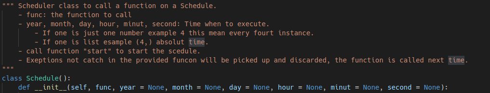
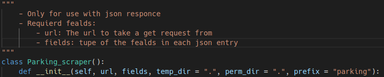
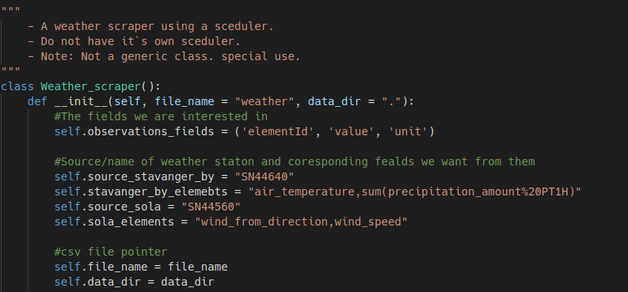
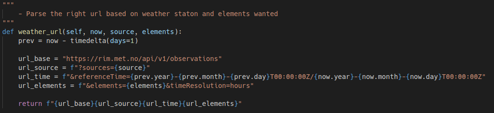

<!-- 
Note. Code contain relative paths so call from within src_R. 
Data must be placed in ../data and separated in parking and weather.
knitting is only tested on Linux
/src_R (this directory)
  /parking_vs_weather (this file)
  ...
/Data
  /parking (only .csv files)
    *.csv
    ...
  /weather (only .csv files)
    *.csv
    ...
  ...
-->
```{css, comment=NA, message=FALSE, echo=FALSE, warning=FALSE}
body {background-color: lightgray;}
```

```{r setup, include=FALSE, comment=NA, message=FALSE}
knitr::opts_chunk$set(echo = TRUE)
source("wrangle.r")
source("regression.r")
library(leaflet) #Map
```

# Introduction:
This project is about testing whether the weather has a say in the number of available parking spaces in Stavanger Norway. The idea is built on the premise that it seam to be harder to find parking space at a public parking lot when the weather is considered bad. But do the data and the impression tell the same story?

I have no personal connection to Stavanger. Stavanger is manly chosen for its publicly available parking data. Thanks to my professor in Data Science [Øystein Myrland](https://uit.no/ansatte/person?p_document_id=41412) at University of Tromsø for the initial idea and inspiration for this project.

This is an automated self updating [website](https://aickro.net/parking) and is updated to include the newest data every day at 6 AM Norwegian time.

### Hypothesis:
The available parking spaces goes down in bad weather.

## Data:
The weather data is collected from:  
Norwegian klima service senter: <https://klimaservicesenter.no/observations/>  
Temperature and Precipitation from station id:SN44640.  
Wind information from station id:SN44560.

The parking data is collected from: 
Stavanger kommune: <https://open.stavanger.kommune.no/dataset/stavanger-parkering/>

More information on each parking lot: <https://stavanger-parkering.no/parkering/p-hus/>

Download updated [data](https://aickro.net/data.zip).

# Presentation:
## Map
Interactive map og the parking lots, made using "leaflet" library:

```{r map, comment=NA, message=FALSE, echo=FALSE, warning=FALSE}
map3 <- leaflet() %>% # use leaflet to crate map
addTiles() #%>%  # Add default OpenStreetMap map tiles
for(n in 1:n_places){ #Add all parking lots from parking df
  temp <- loc_parking[n,]
  map3 <- map3 %>% addMarkers(lat=temp$Lat, lng=temp$Lon, popup=temp$Place)
}
map3
```

Feel free to inspect the map, click on the markers to see the name for the parking lot.

## Correlation
Firstly I want to see if there should be a noteceble correlation in the data, So I start with schema of correlation between the parking lots and the different weather aspects. We use data every day between 08:00 and 18:00 reduce effect of permanent parking.

```{r Correlation, comment=NA, message=FALSE, echo=FALSE, warning=FALSE}
df_temp <- df_main %>% 
  filter(hour(DateTime) >= 8) %>%
  filter(hour(DateTime) <= 18) %>% 
  .[-c(1)]
grid.table(
  abs(
    round(
      cor(
      x=df_temp[,1:9], 
      y=df_temp[,c("Air_temp degC", "Precipitation mm", "wind_speed m/s")], 
      use = "complete.obs", 
      method = c("pearson")
      ), 
      2)
  )
)
```

As we can see this does not paint a clear picture of a correlation. But if we say values over 0.3 is a week correlation we have at least one number above that (Siddis and Air temperature). To inspect further I continue and do linear regression on the data.

## Linear regression
Bellow you find Three interactive regression plots for respectively Air temprure, Precipitation and wind speed. Siddis is set as standard for the regression graphs because it shows the most promising values in the correlation table, but feel free to change and inspect the other parking lots as well. Note. Forum and Parketten have some problems/anomalies in its data (see time graphs bellow).

```{r Regression, comment=NA, message=FALSE, echo=FALSE, warning=FALSE}
# make_regression(data, value) is a function made specific for this data set, and is not intended as a genera function.
df_temp2 <- df_main %>% filter(hour(DateTime) >= 8) %>%
  filter(hour(DateTime) <= 18)
df_temp2 %>% make_regression(., "Air_temp degC")
df_temp2 %>% make_regression(., "Precipitation mm")
df_temp2 %>%  make_regression(., "wind_speed m/s")
```

As of 18.12.2020 we can see the data for the air temperature do seam to go the oppose direction from what I expected. The available parking seam to go down in higher temperature (except for Forum). Precipitation and wind speed do not seam to follow the same trend and some of them goes up and some goes down in higher/lower precipitation and wind speed. This can change as time goes on and more data is collected. The weather unfortunately for this project seam to have bean fairly stable. To inspect even deeper a time plot for both the parking data and weather is plotted bellow.

## Time graphs
This is meant to manually inspect the data and find correlation hidden in the data, Other than noticing the anomelies in forum and parketten I notice a trend showing less available parking on Saturdays. This can maybe introduce errors in the analysis. I do not think I have enough data at the moment to analyze each day of the week separately, but this is something I may add in the future if the same trend continues.

```{r Time_p, comment=NA, message=FALSE, echo=FALSE, warning=FALSE}
df_parking %>% ungroup() %>%
  plot_ly(x = ~DateTime, y = ~Free_spaces, color = ~Place, mode = "lines") %>%
  layout(
    title = list(text = "Parking time graph", x = 0.1),
    yaxis = list(title = "Available parking spaces"),
    xaxis = list(Titel = "Date",
                 rangeselector = list(x = 0.01, y = 0.97,
                   buttons = list(
                     list(
                       count = 1,
                       label = "1 day",
                       step = "day",
                       stepmode = "backward"),
                     list(
                       count = 7,
                       label = "1 week",
                       step = "day",
                       stepmode = "backward"),
                     list(
                       count = 1,
                       label = "1 month",
                       step = "month",
                       stepmode = "backward"),
                     list(
                       count = 1,
                       label = "YTD",
                       step = "year",
                       stepmode = "todate"),
                     list(step = "all"))),
                 rangeslider = list(type = "date"))
    )

```

```{r Time_W, comment=NA, message=FALSE, echo=FALSE, warning=FALSE}
df_weather %>% filter(Element != "wind_direction degrees") %>% ungroup() %>%
  plot_ly(x = ~DateTime, y = ~Value, color = ~Element, mode = "lines") %>%
  layout(
    title = list(text = "weather time graph", x = 0.1),
    yaxis = list(title = "Value"),
    xaxis = list(Titel = "Date",
                 rangeselector = list(x = 0.01, y = 0.97, 
                   buttons = list(
                     list(
                       count = 1,
                       label = "1 day",
                       step = "day",
                       stepmode = "backward"),
                     list(
                       count = 7,
                       label = "1 week",
                       step = "day",
                       stepmode = "backward"),
                     list(
                       count = 1,
                       label = "1 month",
                       step = "month",
                       stepmode = "backward"),
                     list(
                       count = 1,
                       label = "YTD",
                       step = "year",
                       stepmode = "todate"),
                     list(step = "all"))),
                 rangeslider = list(type = "date"))
    )

```

Note that the parking data for parking lot Forum and parketten have some anomolys

## Conclution:

As of 18.12.2020 I can not make any concise statement on if weather affect the available parking in Stavanger. There is no clear correlation but the linear regression is processing and I have high hopes to see some more interesting findings in the future. This project has been fun and instructive nonetheless.

# Methods used:
The source code can be found at: <https://github.com/sso149/Bed-2056-Project>

## Collecting data
I chose to use python 3 for the data collection because i was most familiar with it at the time when i started this project. Python is also a good language to use in this scenario since we are collecting from the web and errors can occur. The exception clause in python make it easy to collect these errors and make sure we do not have a crash if/when a unexpected error occurs. (See code inside src_python)

#### sceduler:

I made my own scheduler in python3 instead of using something like cron in linux. This was mainly because i was personally interested, and I could easily used cron job instead since it runs on a linux server, The only advantage is that no alteration shuld be required to run in another os (not tested). The scheduler is made to not drift regardless of the time it uses to finish one task. After one task is completed it calculates the amount it need to sleep to execute exactly at the right time. The easy way wold be to instead just sleeping a fixed time witch would cause a drift over time. For example for the parking data this means it collect the data exactly at minute 0-4-8-12-16-20-24-28-32-36-40-44-48-52-56 each hour.

  

#### Web scraper:

The scraper is also written in python3 the scraper for parking and weather is separated in classes. Each of the classes have the state/information and functions to request, partition and then store the data. To start the scraper a simple start function is made (see scraper.py) this sets up the schedulers and scrapers for both parking and weather data and start them in separate threads. The parking data is collected every 4 minutes, and the weather is collected every morning at 5 AM Norwegian time, all the data for the previous day is collected and contains the actual recorded weather each hour of the day.

#### The parking scraper class:

  

#### The weather scraper class:

  

To request the weather data directly I inspected the "Norwegian klima service senter" web page and found out how i cold parse and call their web api directly. See code snippet from within the weather class bellow.

  

#### Terminal

The terminal output from the scraping should look something like this:
  

## Data wrangling using r
Since the web scraper just collects and insert the data into files with no further test and corrections the data is far from perfect. There are some missing values, duplicate rows and for two of the parking lots just completely wrong data sometimes. (see code inside src_R/wrangle.r)

The libraries used for the data preparation is manly: tidyverse and lubridate.

#### Preparation steps:
* Firstly i need to read al of the files using "map_dfr" and select the interesting fields.  
* Translate/change the names of the fields, convert Latitude and Longitude to numeric and extract its own data frame.  
* Format the data and time from the parking data frame in to one DataTime, and also set date to datetime for the weather data frame.  
* In the parking df i need to remove all the values equal to 0 (illigal/broken) and set all the values "Fullt" to 0 and then convert to numeric.  
* Modify the elements names in weather df.  
* Remove duplicate rows from parking df and calculate the average for each hour.  
* Then lastly join the two data frames in to a main data frame to use in the plotting/analyze.

## Presentation method:

Lastly this web page is written using RMarkdown and the interactive plots is made using the plotly library (included through wrangle.r). The atomized web page for this site is self hosted on a "work in progress" backend. Let me know if you find/see any problems with ether the data or the web page itself.

